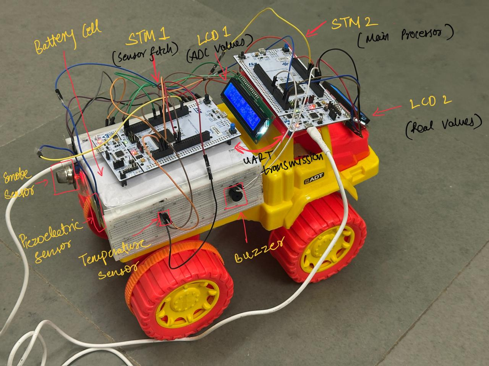

# Microcontroller Based Battery Safety Monitoring System

An embedded systems project aimed at developing a real-time safety monitoring system for batteries. The system uses a multimodal sensor setup to detect early signs of battery failure and categorizes operational states into *Safe*, *Cooldown*, and *Evacuation* based on sensor data.

 

## Overview

This project utilizes the **STM32 Nucleo-L439ZI** boards to build a dual-board communication and monitoring system. It continuously monitors the following parameters:

- **Temperature**
- **Pressure**
- **Voltage**
- **Smoke levels**

The raw sensor data is collected, mapped to realistic values, and processed to determine the battery's safety state.

---

## System Architecture

- **Board 1**: Reads raw ADC values from the sensors and displays them on a local LCD.
- **Board 2**: Receives sensor data via UART, processes it, and shows processed states on a mounted LCD.

---

## Components Used

- STM32 Nucleo-L439ZI ×2  
- 16x2 I2C LCD Display ×2  
- Piezoelectric Pressure Sensor  
- LM35 Temperature Sensor  
- MH MQ-2 Smoke Sensor  
- Buzzer  

---

## States & Conditions

| State         | Conditions                                                                 |
|---------------|----------------------------------------------------------------------------|
| **Safe**      | All sensor readings within nominal range.                                 |
| **Cooldown**  | - Temperature > 70°C    - Voltage < 3.3V                                 |
| **Evacuation**| - Smoke > 700 ppm   - Temperature > 95°C   - Pressure > 3 atm (prolonged) |

---

## Results

- Accurate detection of safety states.
- LCD display reflects real-time sensor conditions.
- System tested with simulated sensor inputs for all edge cases.

**[Final Demonstration Video](https://drive.google.com/file/d/1rvyXpuEU12jV9B2nGEwkIB-Cr2O0nJZe/view?usp=sharing)**

---

## References

- [Research Presentation](https://drive.google.com/file/d/1-kiMIs_N0nfJCPugIz-3Ah2QLj24rwbb/view?usp=drivesdk)
- [I2C Tutorial](https://m.youtube.com/watch?v=e-KgHsQPkwg)
---

## Team

- **Yash Bachwana** [22110295]  
- **Mumuksh Jain** [22110160]  
- **Tarun Meena** [22110271]  
- **Nishant Kumar** [22110170]
